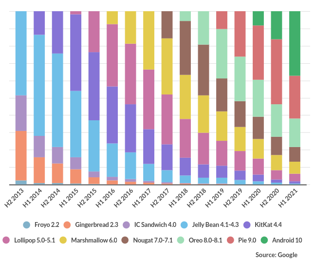
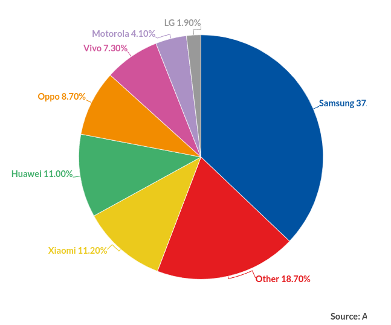
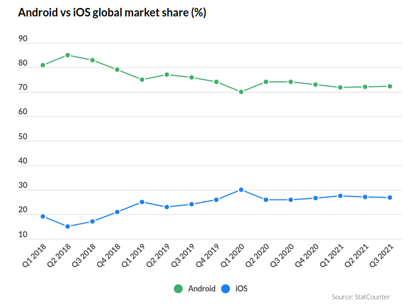

# Android OS

- [Android OS](#android-os)
  - [Общая информация](#общая-информация)
    - [Особенности ОС](#особенности-ос)
    - [Распределение пользователей](#распределение-пользователей)
    - [Достоинства](#достоинства)
    - [Критика](#критика)
  - [Устройства](#устройства)
    - [Экраны устройств](#экраны-устройств)
    - [Возможности адаптивной разработки](#возможности-адаптивной-разработки)
    - [Доступные сенсоры и их применение](#доступные-сенсоры-и-их-применение)
  - [Особенности экосистемы](#особенности-экосистемы)
    - [Доступные магазины](#доступные-магазины)
    - [Google Play](#google-play)
  - [Разработка](#разработка)
    - [SDK](#sdk)
    - [IDE](#ide)
    - [Языки программирования](#языки-программирования)
    - [Тестирование приложений](#тестирование-приложений)
    - [Документация](#документация)
    - [Начало разработки](#начало-разработки)
  - [Источники](#источники)

## Общая информация

Android — операционная система для смартфонов, планшетов, электронных книг, цифровых проигрывателей, наручных часов, фитнес-браслетов, игровых приставок, ноутбуков, нетбуков, смартбуков, очков Google Glass, телевизоров, проекторов и других устройств (в 2015 году появилась поддержка автомобильных развлекательных систем и бытовых роботов) [1].

Изначально разрабатывалась компанией Android, Inc., которую затем приобрела Google. Основана на ядре Linux и собственной реализации виртуальной машины Java компании Google. Впоследствии Google инициировала создание альянса Open Handset Alliance (OHA), который занимается поддержкой и дальнейшим развитием платформы [1].

Android позволяет запускать Java-приложения, управляющие устройством через разработанные Google библиотеки. Android Native Development Kit позволяет портировать библиотеки и компоненты приложений, написанные на Си и других языках [1].

В 86 % смартфонов, проданных во всём мире во втором квартале 2014 года, была установлена операционная система Android. На конференции разработчиков в мае 2017 года Google объявила, что за всю историю Android было активировано более 2 млрд Android-устройств [1].

Текущая актуальная версия Android - Android 12L, которая вышла 7 марта 2022 г. Обновления ОС выходят каждые полгода [3].

Обновления версий Android [3]:

### Особенности ОС

Приложения под операционную систему Android являются программами в нестандартном байт-коде для виртуальной машины Dalvik, для них был разработан формат установочных пакетов `.apk`. Для работы над приложениями доступно множество библиотек: Bionic (библиотека стандартных функций, несовместимая с glibc); мультимедийные библиотеки на базе PacketVideo OpenCORE (поддерживают такие форматы, как MPEG-4, H.264, MP3, AAC, AMR, JPEG и PNG); SGL (движок двухмерной графики); OpenGL ES 1.0 ES 2.0 (движок трёхмерной графики); Surface Manager (обеспечивает для приложений доступ к 2D/3D); WebKit (готовый движок для веб-браузера; обрабатывает HTML, JavaScript); FreeType (движок обработки шрифтов); SQLite (легковесная СУБД, доступная для всех приложений); SSL (протокол, обеспечивающий безопасную передачу данных по сети). По сравнению с обычными приложениями Linux, приложения Android подчиняются дополнительным правилам: Content Providers — обмен данными между приложениями; Resource Manager — доступ к таким ресурсам, как файлы XML, PNG, JPEG; Notification Manager — доступ к строке состояния; Activity Manager — управление активными приложениями. В Android 4.4 появилась возможность сменить виртуальную машину Dalvik на ART (Android Runtime). ART отличается повышенной скоростью загрузки приложения. Проработан механизм оптимизации памяти. В Android 5 перерисован дизайн, базирующийся на концепции Material Design, добавлен режим энергосбережения Project Volta, выбор машины пропал, вместо Dalvik стала использоваться ART. В Android 6 появился интеллектуальный режим расхода энергии Doze и запрет выхода в Интернет и работы в фоне давно не используемых приложений App Standby [1].

Исходный код Андроида доступен на сайте проекта Android Open Source Project (AOSP), который поддерживается Google. Код, присутствующий на AOSP, используется в смартфонах Nexus, а также в серии смартфонов Android One — это модели, производимые другими компаниями, но поддержанные маркетингом Google [1].

Код, доступный на AOSP, дорабатывается производителями аппаратуры (OEM) для выпускаемых моделей, чтобы иметь совместимость с конкретными аппаратными решениями, которые они используют. Исходный код Google не содержит всех необходимых драйверов для этого. В результате, реальные поставляемые устройства на Андроид содержат смесь из программного обеспечения с открытым кодом и закрытым кодом. Например, собственные сервисы Google (Play Market, Services, Maps, Chrome), которые поставляются с большинством смартфонов, также попадают в закрытую категорию [1].

Существует бесчисленное количество операционных систем на основе открытого исходного кода Android (форков), в сообществе их называют «оболочки Android». Данные продукты в основном разрабатываются производителями мобильных телефонов и планшетов для дополнения системы новым функционалом, улучшения качества работы своих устройств и другой модификации системы под свои нужды, внедрения в систему своих сервисов вместо Google Play Services, которые собирают личную информацию о пользователях, например о перемещении пользователя в реальном времени, что привело к судебному разбирательству, своей собственной поддержки операционной системы, например — своих обновлений, которые могут не зависеть от версии Android и предоставлять один и тот же функционал на разных версиях Android. Большинство оболочек Android предоставляет свои алгоритмы безопасности пользователей, но в то же время использует патчи безопасности для Android. На оболочках Android, так же, как и на большинстве других Unix-подобных операционных систем, можно получить root-доступ (права суперпользователя), но это автоматически ставит устройство под угрозу, так как, если вирусное ПО получит доступ к правам суперпользователя, оно может сильно повредить устройство, как программно, так и физически; также неопытный пользователь может повредить устройство самостоятельно, поэтому разработчики отключают возможность получить права суперпользователя и блокируют загрузчик у своих устройств, а при их использовании производитель имеет право аннулировать гарантию и отказать в дальнейшей поддержке устройства. Также при разблокировке загрузчика устройства, если такая возможность представлена производителем, смартфон теряет безопасность, злоумышленник может прошить смартфон на модифицированную прошивку без алгоритмов защиты операционной системы от кражи или прошить прошивку на базе другой оболочки Android [1].

### Распределение пользователей

Распределение устройств по версиям ОС [4]:

Распределение устройств по вендорам [4]:

Доля рынка Android vs iOS [4]:

Актуальное распределение пользователей и количество устройств, на которых запустится приложение, можно посмотреть при создании проекта в Android Studio [2].

### Достоинства

Преимущества OS Android [1]:

- Некоторые обозреватели отмечают, что Android проявляет себя лучше одного из своих конкурентов, Apple iOS, в ряде особенностей, таких как веб-сёрфинг, интеграция с сервисами Google и прочих. Также Android, в отличие от iOS, является открытой платформой, что позволяет реализовать функции большему числу разработчиков.
- Несмотря на изначальный запрет на установку программ из «непроверенных источников» (например, с карты памяти), это ограничение отключается штатными средствами в настройках аппарата, что позволяет устанавливать программы на телефоны и планшеты без интернет-подключения, а также позволяет всем желающим бесплатно писать приложения для Android и тестировать на своём аппарате.
- Android доступен для различных аппаратных платформ, таких как ARM, MIPS, x86.
- Существуют альтернативные Google Play магазины приложений: Amazon Appstore, Uptodown App Store, Opera Mobile Store, Яндекс.Store, GetApps, Mobogenie, F-Droid, 1Mobile Market, Meizu Appstore, AppGallery, Aurora Store, Aptoide.
- В версии 4.3 введена поддержка многопользовательского режима.

### Критика

Недостатки ОС Android [1]:

- В сертифицированных Android-устройствах есть сервисы Google, обеспечивающие возможность передачи идентификационной информации на серверы компании, например информации о перемещении пользователя в реальном времени.
- В версии Android 1.6 разработчики добавили Native Development Kit, который позволяет писать собственные низкоуровневые модули для системы на языках C/С++, опираясь на стандартные Linux-библиотеки. Хотя, например, стандартная библиотека языка Си на платформе Android, известная как Bionic, как раз не является стандартной и полностью совместимой с libc.
- Для доступа к Google Play и другим сервисам Google необходимо использовать проприетарные приложения, которые производитель телефона имеет право устанавливать на телефон только после заключения контракта с Google.
- Конкуренты Android выступили с критикой платформы, обвиняя её в чрезмерной фрагментации, создающей препятствия разработчикам. Но Google отвергла все обвинения, заявив, что никаких подобных проблем нет.
- Подверглось критике решение Google не размещать в широком доступе код Android 3.0 Honeycomb, доступный только для участников Open Handset Alliance или по индивидуальному запросу после подписания соглашения. Google мотивирует это неготовностью платформы и мерой предупреждения небрежной её реализации. Ричард Столлман заявлял, что «всё просто и ясно: за исключением ядра Linux, Android 3 представляет собой несвободный софт» и «несмотря на то, что телефоны с Android на сегодняшний день не так плохи, как смартфоны Apple или Windows, нельзя сказать, что они уважают вашу свободу». В настоящий момент Google открыл исходный код для всех версий Android вплоть до 8.1.0, а также отправил в Linux все изменения, в соответствии с GPL.
- По данным Lookout Security Mobile, за 2011 год у пользователей Android-смартфонов было украдено около миллиона долларов США (напр., отправка СМС без ведома владельца телефона).
- Android (как и IOS) не поддерживает атрибут download, используемый в HTML для загрузки файлов из интернета.

## Устройства

На ОС Android работают следующие устройства [1]:

- телефоны
- планшеты
- фоторамки
- наручные часы (I'm Watch)
- фотокамеры (Nikon)
- медиаплеер (Nexus Q, Nexus Player)

На май 2021 число устройств с Android в мире превысило 3 млрд [1].

### Экраны устройств

Т. к. на платформе Android работает множество разных устройств, размеры экранов у них также сильно различаются. Есть устройства с экранами 240x240 пикселей размером 1.54 дюйма (I'm Watch), есть 4K и 8K мониторы размером 40-50 дюймов, которые также должны поддерживать корректную работу ОС и приложений в ней. При разработке приложений необходимо определить целевую аудиторию приложения, определить наиболее часто используемые устройства у этой ЦА, а после этого проанализировать, какие из устройств и размеров экранов наиболее выгодно поддерживать [2].

### Возможности адаптивной разработки

Android SDK, Flutter и React Native предоставляют широкие возможности по разработке адаптивных приложений, хорошо работающих как на маленьких, так и на больших экранах. Однако для этого необходимо нарисовать дизайн приложения на экранах различных размеров, после чего правильно реализовать задуманный дизайн приложения [2].

### Доступные сенсоры и их применение

Доступные сенсоры и их применение [5]:

- акселерометр - обнаружение движения (тряска, наклон)
- датчик температуры окружения (ambient temperature) - мониторинг температуры воздуха
- датчик силы гравитации - обнаружение движения (тряска, наклон)
- гироскоп - обнаружение вращения (вращение, поворот)
- датчик освещенности - управление яркостью экрана
- датчик линейного ускорения - мониторинг ускорения по одной оси
- датчик магнитного поля - создание компаса
- датчик ориентации устройства - определение положения устройства
- датчик давления - мониторинг изменения давления воздуха
- датчик расстояния (proximity) - определение положения телефона во время звонка
- датчик относительной влажности - определение абсолютной и относительной влажности
- датчик вектора вращения - определение движения и вращения
- датчик температуры - мониторинг температуры

## Особенности экосистемы

### Доступные магазины

Т. к. доступна установка локально или из внешних источников, то существует множество магазинов с приложениями [1]:

- Google Play Store (основной)
- F-Droid
- Amazon Appstore
- Samsung Apps
- AppGallery
- Uptodown App Store
- Opera Mobile Store
- Яндекс.Store
- GetApps
- Mobogenie
- 1Mobile Market
- Meizu Appstore
- Aurora Store
- Aptoide

### Google Play

22 октября 2008 года Google объявила об открытии онлайн-магазина приложений для ОС Android — Android Market. По соглашению, разработчики получают 70 % прибыли, операторы сотовой связи — 30 %. В феврале 2009 года для разработчиков из США и Великобритании появилась возможность брать плату за свои приложения в Android Market [1].

К марту 2012 года интернет-магазин Google Play работал в 190 странах и насчитывал более 700 тысяч приложений, а за время работы сервиса набралось около 25 млрд скачиваний [1].

## Разработка

### SDK

Google предлагает для свободного скачивания инструментарий для разработки (Software Development Kit), который предназначен для x86-машин под операционными системами Linux, macOS (10.4.8 или выше), Windows XP, Windows Vista и Windows 7. Для разработки требуется JDK 5 или более новый. Разработку приложений для Android можно вести на языке Java (не ниже Java 1.5) [1].

В 2009 году в дополнение к ADT был опубликован Android Native Development Kit (NDK) — пакет инструментариев и библиотек, позволяющий реализовать часть приложения на языке С/С++. NDK рекомендуется использовать для разработки участков кода, критичных к скорости [1].

Помимо этого, разрабатывать мобильные приложения под ОС Android можно с помощью Flutter (Dart), React Native (JS/TS), Cordova (JS/TS) и подобных фреймворков [2].

### IDE

Существует плагин для Eclipse — Android Development Tools (ADT), предназначенный для Eclipse версий 3.3—3.7. Также существует плагин для IntelliJ IDEA, облегчающий разработку Android-приложений, и для среды разработки NetBeans IDE, который, начиная с версии NetBeans 7.0, перестал быть экспериментальным, хоть пока и не является официальным. Кроме того, существует Motodev Studio for Android — комплексная среда разработки на базе Eclipse, позволяющая работать непосредственно с Google SDK [1].

В 2013 году Google представила новую среду разработки Android Studio, основанную на IntelliJ IDEA компании JetBrains [1].

В 2013 году состоялся релиз Embarcadero RAD Studio — XE5. Возможность разработки нативных приложений для платформы Android. Процесс создания Android-приложения не требует дополнительных устройств, кроме, собственно, Android-устройства (в принципе, можно обойтись и эмулятором) [1].

### Языки программирования

При работе Android SDK можно использовать Java и Kotlin, причем можно использовать вместе в одном проекте [2].

При работе с Android NDK можно использовать C и C++ [2].

При работе с Flutter можно использовать Dart [2].

При работе с React Native, Cordova и подобными JS фреймворками можно использовать JavaScript и TypeScript [2].

### Тестирование приложений

Приложения можно устанавливать и запускать прямо из `.apk` файла, если в настройках включена установка приложений из незащищенных источников. Это позволяет удобно разрабатывать и тестировать приложения, т. к. для из установки не требуется делать никаких дополнительных действий [2].

При разработке в IDE с использованием Android SDK, Flutter, React Native и многих других инструментов возможно устанавливать и запускать разрабатываемые приложения (и даже обновлять уже установленные приложения) по нажатию одной кнопки "Run". Это оказывается очень удобным при разработке, т. к. можно за несколько секунд посмотреть, к чему приводит конкретное изменение в коде [2].

При тестировании для запуска приложений можно использовать как эмулятор устройств Android, который входит в Android SDK и устанавливается через Android Studio, так и физическое устройство. Использование эмулятора хорошо тем, что можно протестировать приложение на множестве устройств различных размеров и версий ОС, но запуск множества эмуляторов требует много вычислительных ресурсов. Тестирование на физическом устройстве удобнее тем, что не требует дополнительных ресурсов на рабочем компьютере, а также позволяет оценить работу приложения на полноценном реальном устройстве со всеми его особенностями [2].

Более того, работать с физическим устройством можно даже без подключения его по USB к компьютеру, если включить в настройках разработчика на телефоне функцию "ADB over air" [2].

### Документация

Google предоставляет отличную [документацию](https://developer.android.com/) по разработке под Android. Для других фреймворков (Flutter, React Native и т. д.) есть подобные документации [2].

### Начало разработки

Для начала разработки необходимо [2]:

1. выбрать и изучить [фреймворк или библиотеку](#sdk)
2. установить [IDE или текстовый редактор](#ide)
3. создать проект в соотвествие с инструкцией выбранного фреймворка или библиотеки

Для публикации в магазин приложений Google Play Store необходимо [6]:

1. создать аккаунт разработчика Google
2. оплатить единовременную плату в $25 (1 раз на аккаунт, а не на приложение)
3. создать Google Wallet Merchant и привязать его к аккаунту
4. подготовить документы (EULA, privacy policy, terms and conditions)
5. создать приложение в Google Console
6. загрузить `.apk` файл и отправить его на ревью

## Источники

1. [Википедия](https://ru.wikipedia.org/wiki/Android)
2. я (поправьте, если есть фактическая ошибка)
3. [Википедия](https://en.wikipedia.org/wiki/Android_version_history#Android_12)
4. [Business of Apps](https://www.businessofapps.com/data/android-statistics/)
5. [Android Developers](https://developer.android.com/guide/topics/sensors/sensors_overview)
6. [Brainvire](https://www.brainvire.com/blog/publish-app-play-store/)
